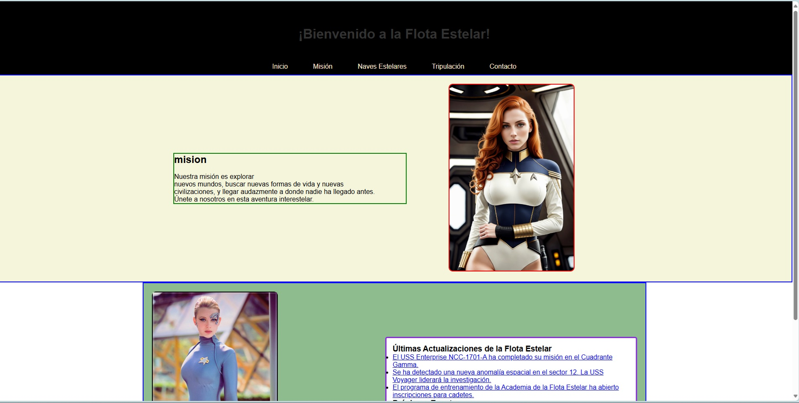

 # Página de Star Trek

Este proyecto es una página web inspirada en la temática de Star Trek. Fue desarrollada como parte de mi aprendizaje en **HTML** y **CSS**, centrándome especialmente en trabajar con contenedores y estructuras en CSS.

## 🚀 Objetivo del Proyecto

El propósito principal de esta página es mejorar mis habilidades en diseño web básico mientras avanzo en mi camino de aprendizaje hacia el desarrollo web completo.

## 🛠️ Tecnologías Utilizadas

- **HTML**: Para la estructura del contenido de la página.
- **CSS**: Para el diseño y la maquetación, con énfasis en contenedores y flexbox.

## 📂 Archivos Principales

- `index.html`: Estructura principal de la página.
- `style.css`: Estilos aplicados a la página.
- Carpeta `image/`: Contiene las imágenes utilizadas en el proyecto.

## 💡 Lecciones Aprendidas

- Cómo usar contenedores en CSS para organizar elementos de manera eficiente.
- Mejora de habilidades con `flexbox` y otros conceptos básicos de CSS.

## 🎯 Próximos Pasos

1. Agregar más funcionalidad a la página con **JavaScript**.
2. Explorar la implementación de diseño responsivo.
3. Seguir desarrollando proyectos más avanzados.

---

¡Gracias por visitar este proyecto! 😊
